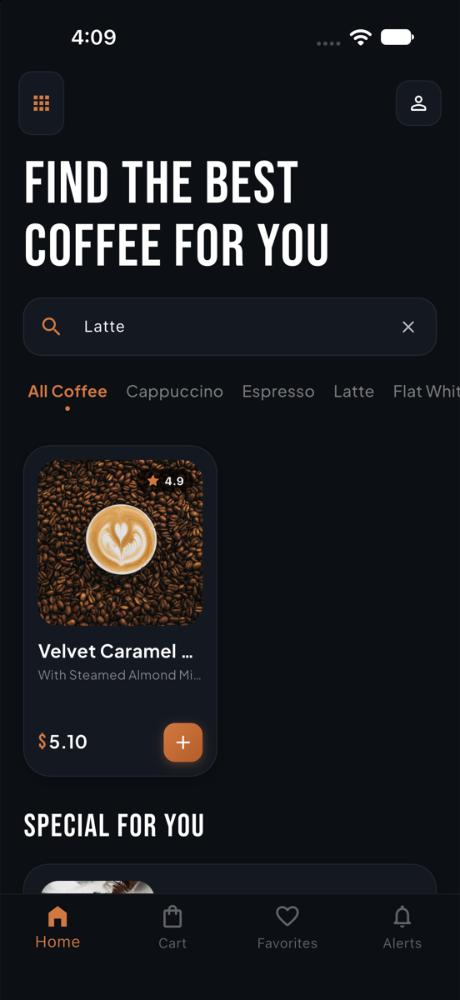

# Artisan Coffee

A Flutter mobile application for browsing and ordering specialty roast coffees, featuring a refined dark theme, realtime search filtering, and animated category selection.

[](https://flutter.dev/)
[](https://dart.dev/)
[](https://flutter.dev/)
[](LICENSE)

---

## Screenshots

<div align="center">
  <table>
    <tr>
      <td align="center" width="50%">
        <strong>Product Catalog</strong><br /><br />
        
      </td>
      <td align="center" width="50%">
        <strong>Search & Filter</strong><br /><br />
        
      </td>
    </tr>
  </table>
</div>

---

## Features

* **Dark Theme UI:** Deep obsidian backgrounds (`#0C0F14`) with amber/caramel accents (`#D17842`) and high-contrast typography via Google Fonts (Rosarivo).
* **Live Search & Category Filtering:** Instant client-side filtering across coffee varieties (Cappuccino, Espresso, Latte, Flat White) and tasting notes.
* **Cart Interactions:** Animated item additions with non-intrusive feedback notifications.
* **Modern Flutter & Dart 3 Support:** Fully compatible with Dart 3.x, zero deprecated API calls, and clean analyzer output.
* **Widget Test Suite:** Unit and widget test coverage for catalog rendering, search querying, and category toggles.

---

## Project Structure

```
lib/
├── main.dart             # Application root, theme configurations
├── colors.dart           # Color palette constants
├── data.dart             # Coffee roast data models & mock database
└── ...
test/
└── widget_test.dart      # Widget tests for catalog and search logic
docs/
└── screenshots/          # Application screenshots
```

---

## Getting Started

### Prerequisites
* Flutter SDK (3.24+ recommended)
* Xcode (for iOS) or Android Studio (for Android)

### Installation & Run

1. Clone the repository:
   ```bash
   git clone https://github.com/Ghost-9/Coffee-App.git
   cd Coffee-App
   ```

2. Install dependencies:
   ```bash
   flutter pub get
   ```

3. Run test suite:
   ```bash
   flutter test
   ```

4. Launch the application:
   ```bash
   flutter run
   ```

---

## License

This project is licensed under the [MIT License](LICENSE).
